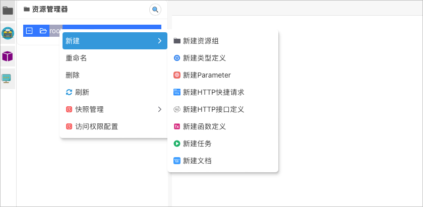

# CatMan Workbench

> ⚠️ **This project is still under development and is not ready for production use.**

## Introduction
CatMan Workbench is a distributed application for building customized workflows and building richer functionality on top of them. It provides a user-friendly interface for managing and maintaining the components involved in a customized workflow.
On the basis of custom workflow , you can use its trigger mechanism to achieve richer business scenarios , such as .
With HTTP triggers and custom workflows , you can create .
- Work approval flow
- CI/CD tools
- GIT BOT
- Customized API gateway
- Customized data synchronization
- Customized data analysis
- And more

With cron triggers and custom workflows , you can create .
- Scheduled tasks
- Data synchronization
- Data analysis
- And more

With message queue triggers and custom workflows , you can create .
- Message queue processing

With custom triggers and custom workflows , you can create .
- Customized business scenarios
With local triggers and custom workflows , you can create .
- execute some tasks when local file changes

CatMan Workbench is a distributed application, which means that it can be 
deployed on multiple servers to achieve high availability and load balancing. 
It is also designed to be highly scalable, 
so you can add more servers as your needs grow.

Cat Man Workbench provides a dynamic access mechanism. You can deploy 
working nodes locally or on any server and access central services.

Its built-in scheduling strategy and execution strategy are isolated from
resources. Users can isolate and share resources for various departments 
and even individuals in the same CatMan Workbench service according to 
their own needs.

## Features
- **Customized workflow** - Create and manage your own workflows.
- **Richer resource support** - Support for more resource types, such as HTTP, GIT, and more.
- **Richer data type definitions** - Support for more data types, such as JSON, XML, and more.
- **Support custom HTTP protocol** - Support for more HTTP protocols, such as HTTP, HTTPS, and more.
- **More intelligent request body analysis** - Support for more intelligent request body analysis, such as JSON, XML, and more.
- **Highly customized layout management** - Support for more highly customized layout management, such as drag and drop, and more.
- **Freer query rule creator** - Support for more freer query rule creator, such as SQL, and more.
- **More intelligent data analysis** - Support for more intelligent data analysis, such as data visualization, and more.
- **More intelligent data synchronization** - Support for more intelligent data synchronization, such as data synchronization, and more.

### Richer resource support

### Richer data type definitions

### Support custom HTTP protocol

### More intelligent request body analysis

### Highly customized layout management

### Freer query rule creator
